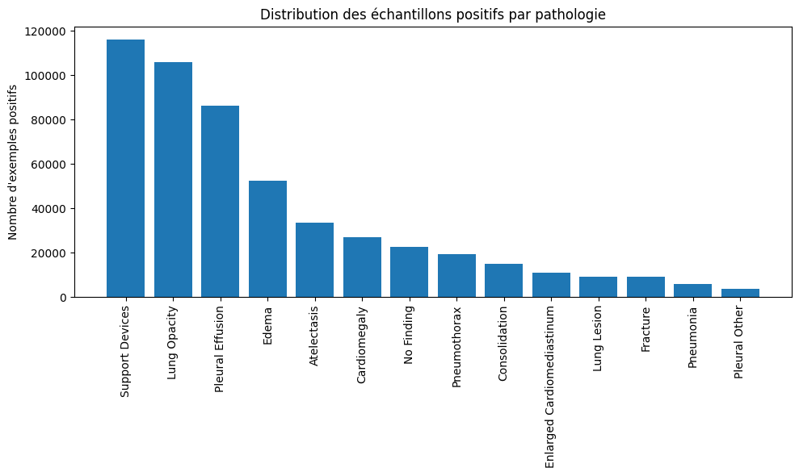
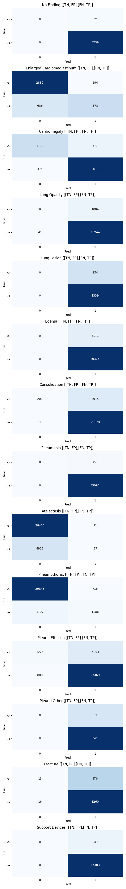
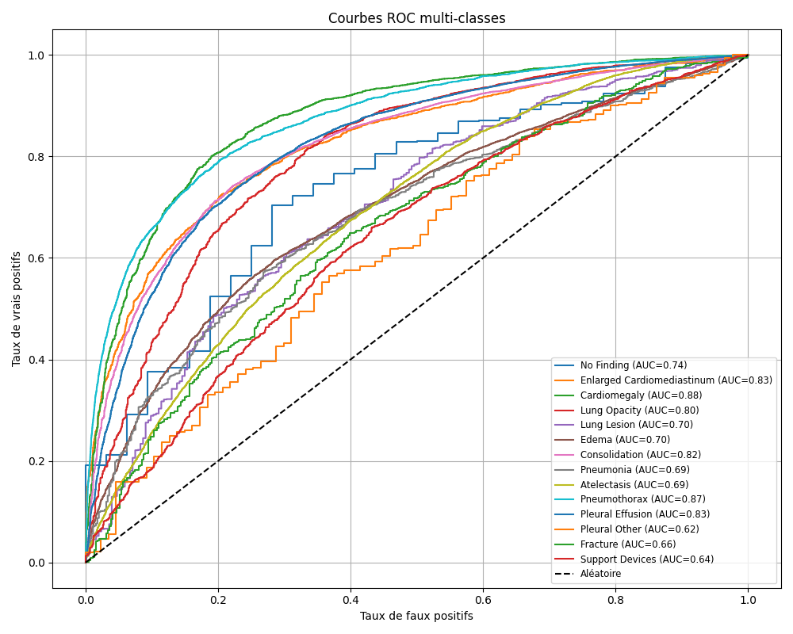

# T-DEV-810

## Contexte et objectif
Ce projet vise à construire un **classifieur multi‐labels** pour détecter plusieurs pathologies thoraciques à partir de radiographies de thorax.

Voici les différentes pathologies à identifier : 
- No Finding
- Enlarged Cardiomediastinum
- Cardiomegaly
- Lung Opacity
- Lung Lesion
- Edema
- Consolidation
- Pneumonia
- Atelectasis
- Pneumothorax
- Pleural Effusion
- Pleural Other
- Fracture
- Support Devices

## Tâche de classification
- **Type** : classification **multi‐labels** (une image peut appartenir à plusieurs classes).  
- **Entrée** : image radiographique (224×224 pixels, RGB)  
- **Sortie** : vecteur de 14 scores/logits, un par pathologie, convertis en probabilités via une sigmoid.  
- **Décision** : on applique un seuil (par défaut 0.5 ou optimisé par pathologie) pour chaque probabilité afin de produire un vecteur binaire de pré­dic­tions.

## Dataset : CheXpert
- **Source** : Stanford CheXpert (Irvin et al., 2019), grand jeu de données de radiographies thoraciques annotées de façon semi‐automatique.  
- **Taille** :  
  - Environ **224 316** images d’entraînement (version complète),  
  - Ici downsampler pour limiter la taille du dataset (+ 400Go normalement)
  - Lien vers le dataset utilisé : https://www.kaggle.com/datasets/ashery/chexpert
- **Étiquettes** : 14 catégories cliniques (ex. “No Finding”, “Pneumonia”, “Edema”…).  
- **Valeurs des labels** :  
  - `1` = pathologie présente  
  - `0` = pathologie absente  
  - `-1` = incertain (annotation douteuse)  
- **Particularités** :  
  - Jeu fortement déséquilibré (certaines pathologies très rares)  
  - Étiquettes produites par extraction automatique de rapports radiologiques, d’où la présence de cas “incertains” à gérer par masquage ou mapping.

## Étude de nos données

Répartition des labels : 

On remarque tout de suite un gros déséquilibre dans nos données, il faudra donc correctement géré ca au moment de l'entrainement.



## Modèle et architecture (model.py)


## Entrainement (train.py)

L'objectif est ici d'entrainer et de prendre en compte les différentes problématiques du dataset et des mécanisme spécifique

* le **déséquilibre des classes** (ex : maladies rares),
* la **présence de labels manquants** (non étiquetés),
* une **optimisation dynamique du learning rate**,

Chaque composant est choisi pour **maximiser la robustesse, la stabilité et la généralisation** du modèle.

### 1. 🔍 Focal Loss Masquée

#### ✅ Pourquoi utiliser la **Focal Loss** ?

La **focal loss** a été introduite pour **gérer les classes déséquilibrées**

* Elle **réduit le poids des exemples bien classés**, pour que le modèle se concentre davantage sur ceux difficiles ou mal prédits.

#### Pourquoi **masquer** certaines données ?

Dans les datasets médicaux (comme CheXpert), certains labels sont manquants (annotés -1). Ces cas ne doivent **pas contribuer à la perte**.

Le masque binaire $\text{mask} \in \{0, 1\}$ permet d'**ignorer les labels inconnus** dans la backpropagation.


### 2. ⚖️ Oversampling ciblé via `WeightedRandomSampler`

#### ⚠️ Problème : classes très déséquilibrées

Certaines maladies sont **très rares** dans les données d’entraînement.

#### 💡 Solution : augmenter artificiellement la fréquence des cas rares

On utilise un `WeightedRandomSampler` pour :

* donner **plus de chances d’être tirés** aux exemples **positifs valides** des classes rares,
* sans dupliquer réellement les données.

On applique un **facteur multiplicatif** sur les poids des exemples positifs valides (selon la classe).

Cela permet de :

* **améliorer la couverture** des cas rares durant l’entraînement,
* **réduire le biais** du modèle vers la prédiction « tout est normal ».

### 3. Poids de classe dans la fonction de perte

#### 🔍 Pourquoi pondérer les classes ?

Même après oversampling, certaines classes restent peu fréquentes → le modèle peut sous-optimiser ces sorties.

On calcule :

```python
pos_weight = neg / (pos + 1e-6)
```

* Chaque classe reçoit un **poids proportionnel au ratio négatifs/positifs**.
* Ces poids sont utilisés dans la `FocalLoss` (via `alpha`), pour **augmenter la pénalité d’erreur sur les classes sous-représentées**.

### 4. OneCycle Learning Rate Scheduler

#### Pourquoi scheduler dynamiquement le learning rate ?

Le scheduler **OneCycleLR** est basé sur les travaux de Leslie Smith. Il permet :

* d’augmenter d'abord le learning rate (pour explorer largement),
* puis de le réduire progressivement (pour affiner la convergence).

Ce cycle :

* **accélère la convergence**,
* **évite les minima locaux plats**,
* et **réduit le sur-apprentissage**.

### 5. Entraînement avec masquage et métriques robustes

#### Entraînement

* Les labels sont multi-labels binaires : chaque exemple peut avoir plusieurs classes positives.
* Le modèle sort des **logits bruts**, et la fonction de perte applique ensuite le **sigmoïde + BCE**.

#### Masquage dans la validation

On utilise un masque pour ignorer les labels invalides **aussi durant l’évaluation** :

```python
mask_flat = np.vstack(masks).flatten().astype(bool)
p_flat = preds_np.flatten()[mask_flat]
t_flat = trues_np.flatten()[mask_flat]
```

#### 📊 Métriques multi-label :

* `accuracy` : exactitude globale.
* `precision`, `recall`, `f1_score` :

  * **macro-moyennés** (chaque classe compte autant),
  * **robustes aux classes déséquilibrées**,
  * utiles pour évaluer la **qualité de la détection des classes rares**.

### 7. 📈 Visualisation des courbes d’entraînement

À la fin, on trace :

* la perte d’entraînement et de validation,
* les métriques de performance.

Cela permet de :

* **visualiser la convergence**,
* **détecter un overfitting**,
* **comparer différentes stratégies de sampling, loss ou architecture.**

## Evaluation





### Résultats et métriques

| Classe                         | Précision | Rappel | F1-score | Support |
|-------------------------------|-----------|--------|----------|---------|
| No Finding                    | 🟢 0.99   | 🟢 1.00 | 🟢 1.00   | 3271    |
| Enlarged Cardiomediastinum    | 🟢 0.75   | 🟠 0.56 | 🟠 0.64   | 4740    |
| Cardiomegaly                  | 🟢 0.86   | 🟢 0.90 | 🟢 0.88   | 5692    |
| Lung Opacity                  | 🟢 0.94   | 🟢 1.00 | 🟢 0.97   | 17023   |
| Lung Lesion                   | 🟢 0.84   | 🟢 1.00 | 🟢 0.91   | 1593    |
| Edema                         | 🟢 0.91   | 🟢 1.00 | 🟢 0.95   | 33547   |
| Consolidation                 | 🟢 0.88   | 🟢 0.99 | 🟢 0.93   | 33547   |
| Pneumonia                     | 🟢 0.99   | 🟢 1.00 | 🟢 0.99   | 33547   |
| Atelectasis                   | 🔴 0.49   | 🔴 0.02 | 🔴 0.03   | 33547   |
| Pneumothorax                  | 🟠 0.62   | 🟠 0.40 | 🟠 0.49   | 33547   |
| Pleural Effusion              | 🟢 0.87   | 🟢 0.97 | 🟢 0.92   | 33547   |
| Pleural Other                 | 🟢 0.86   | 🟢 1.00 | 🟢 0.93   | 629     |
| Fracture                      | 🟢 0.77   | 🟢 0.99 | 🟢 0.87   | 1665    |
| Support Devices               | 🟢 0.95   | 🟢 1.00 | 🟢 0.97   | 18340   |
| **Moyenne globale (macro)**   | 🟢 **0.8370** | 🟢 **0.8449** | 🟢 **0.8199** | **-**   |

